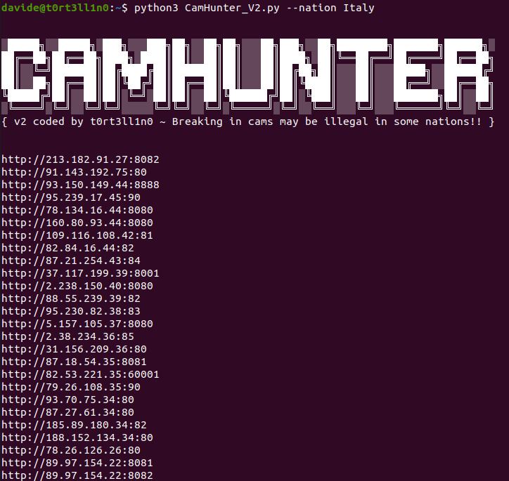
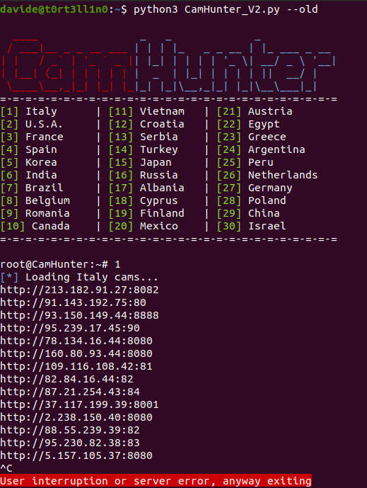

# CamHunter v2
This python3 script is the 2^ version of the preview archived version of CamHunter



## Installation:

````~$ git clone https://www.github.com/t0rt3ll1n0/CamHunterV2.git````

````~$ cd CamHunterV2````

````~$ python3 CamHunter_V2.py --help````

## Options:

Request for {Nation} links:

````~$ python3 CamHunter_V2.py --nation {Nation}````

Show avaiable nations:


````~$ python3 CamHunter_V2.py --show````

Show basic version info:


````~$ python3 CamHunter_V2.py --version````

Use old wizard interface:


````~$ python3 CamHunter_V2.py --old````

Show help:

````~$ python3 CamHunter_V2.py --help (OR) -h````

Update CamHunter to the latest version [sudo needed]

````~$ sudo python3 CamHunter_V2.py --update````


## Combined options:
With ````--output```` you can save the output to a text file

````~$ python3 CamHunter_V2.py --nation {Nation} --output {Outputfile}````

Old interface:


